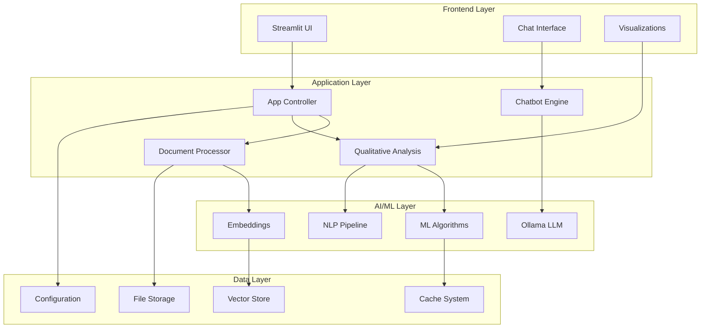

# 🧠 CogniChat - Sistema RAG Avanzado con Análisis Cualitativo Inteligente

<div align="center">


[](https://python.org)
[](https://streamlit.io)
[](https://ollama.ai)
[](https://docker.com)
[](LICENSE)

**Sistema de Recuperación y Generación Aumentada (RAG) con capacidades avanzadas de análisis cualitativo, procesamiento inteligente de documentos y visualización interactiva.**

[🚀 Inicio Rápido](#-instalación-y-configuración) • [📖 Documentación](#-documentación) • [🎯 Características](#-características-principales) • [🤝 Contribuir](#-contribuciones)

</div>

---

## 🎯 Características Principales

### 📄 **Procesamiento Inteligente de Documentos**
- **Formatos Múltiples**: PDF, DOCX, TXT, Excel con validación automática
- **Chunking Avanzado**: Preservación de contexto semántico
- **Embeddings Vectoriales**: Búsqueda semántica de alta precisión
- **Cache Optimizado**: Rendimiento mejorado con almacenamiento inteligente

### 🤖 **Chatbot Conversacional Avanzado**
- **Modelos Locales**: Integración completa con Ollama (DeepSeek-R1, Llama, Mistral)
- **Respuestas Contextuales**: Basadas en documentos cargados con trazabilidad
- **Historial Persistente**: Conversaciones guardadas y recuperables
- **Multi-modelo**: Selección dinámica de LLM según necesidades

### 📊 **Análisis Cualitativo Automatizado**
- **Extracción de Temas**: LDA (Latent Dirichlet Allocation) y BERTopic
- **Clustering Inteligente**: K-means, HDBSCAN y UMAP para agrupación
- **Análisis de Sentimientos**: VADER, TextBlob y modelos transformer
- **Mapas Conceptuales**: Redes interactivas con NetworkX y Pyvis
- **Nubes de Palabras**: Visualización personalizable de términos clave

### 🎨 **Visualizaciones Interactivas**
- **Gráficos Dinámicos**: Plotly para exploración interactiva
- **Redes de Conceptos**: Visualización de relaciones semánticas
- **Dashboards en Tiempo Real**: Métricas y estadísticas actualizadas
- **Distribuciones Estadísticas**: Análisis visual con Seaborn y Matplotlib

### 🔧 **Características Técnicas Avanzadas**
- **Arquitectura Modular**: Componentes desacoplados y extensibles
- **Sistema de Alertas**: Monitoreo en tiempo real y logging avanzado
- **Configuración Flexible**: Variables de entorno y configuración dinámica
- **Exportación Completa**: PDF, Excel, JSON con metadatos completos

---

## 🚀 Instalación y Configuración

### 📋 **Requisitos del Sistema**

| Componente | Versión Mínima | Recomendado |
|------------|----------------|-------------|
| Python | 3.8+ | 3.11+ |
| RAM | 8GB | 16GB+ |
| Almacenamiento | 10GB | 20GB+ |
| Ollama | Latest | Latest |

### 🐳 **Opción 1: Despliegue con Docker (Recomendado)**

```bash
# 1. Clonar el repositorio
git clone https://github.com/tu-usuario/CogniChat.git
cd CogniChat

# 2. Configurar variables de entorno
cp .env.example .env
# Editar .env según tus necesidades

# 3. Ejecutar script automatizado
.\scripts\setup-docker.ps1

# 4. Descargar modelos de IA
.\scripts\download-models.ps1

# 5. Iniciar servicios
docker compose up -d
```

**🌐 Acceso**: http://localhost:8501

### 🐍 **Opción 2: Instalación Local**

#### **Paso 1: Preparación del Entorno**

```bash
# Clonar repositorio
git clone https://github.com/tu-usuario/CogniChat.git
cd CogniChat

# Crear entorno virtual
python -m venv cognichat-env

# Activar entorno (Windows)
cognichat-env\Scripts\activate

# Activar entorno (Linux/macOS)
source cognichat-env/bin/activate
```

#### **Paso 2: Instalación de Dependencias**

```bash
# Verificar dependencias del sistema
python scripts/check_dependencies.py

# Instalación automática
python scripts/install_requirements.py

# O instalación manual
pip install -r requirements.txt
```

#### **Paso 3: Configuración de Ollama**

```bash
# Instalar Ollama (si no está instalado)
# Windows: Descargar desde https://ollama.ai
# Linux: curl -fsSL https://ollama.ai/install.sh | sh

# Descargar modelos requeridos
ollama pull deepseek-r1:7b
ollama pull nomic-embed-text:latest

# Verificar instalación
ollama list
```

#### **Paso 4: Configuración Final**

```bash
# Copiar configuración de ejemplo
cp .env.example .env

# Editar variables de entorno
# OLLAMA_BASE_URL=http://localhost:11434
# DEFAULT_LLM_MODEL=deepseek-r1:7b
# DEFAULT_EMBEDDING_MODEL=nomic-embed-text:latest

# Ejecutar aplicación
streamlit run app.py
```

---

## 📖 Guía de Uso

### 🎮 **Interfaz Principal**

La aplicación se organiza en **4 pestañas principales**:

#### 📄 **1. Gestión de Documentos**
```python
# Formatos soportados
SUPPORTED_FORMATS = {
    'PDF': ['.pdf'],
    'Word': ['.docx', '.doc'],
    'Excel': ['.xlsx', '.xls'],
    'Texto': ['.txt', '.md']
}

# Límites de archivo
MAX_FILE_SIZE = 50  # MB por archivo
MAX_TOTAL_SIZE = 200  # MB total
```

**Funcionalidades**:
- ✅ Carga múltiple con drag & drop
- ✅ Validación automática de formato y tamaño
- ✅ Vista previa de contenido
- ✅ Eliminación selectiva o masiva
- ✅ Estadísticas de procesamiento

#### 💬 **2. Chat Inteligente**
```python
# Configuración de chat
CHAT_CONFIG = {
    'max_history': 50,
    'context_window': 4096,
    'temperature': 0.7,
    'top_p': 0.9
}
```

**Capacidades**:
- 🤖 Conversación natural con IA
- 📚 Respuestas basadas en documentos cargados
- 🔄 Selección dinámica de modelos LLM
- 📝 Historial persistente con timestamps
- 🔍 Trazabilidad de fuentes citadas

#### 📊 **3. Análisis Cualitativo**
```python
# Técnicas de análisis disponibles
ANALYSIS_METHODS = {
    'topic_modeling': ['LDA', 'BERTopic', 'NMF'],
    'clustering': ['K-means', 'HDBSCAN', 'Agglomerative'],
    'sentiment': ['VADER', 'TextBlob', 'Transformers'],
    'visualization': ['WordCloud', 'NetworkX', 'UMAP']
}
```

**Análisis Disponibles**:
- 🎯 **Extracción de Temas**: Identificación automática de tópicos principales
- 🔗 **Clustering de Documentos**: Agrupación por similitud semántica
- 😊 **Análisis de Sentimientos**: Polaridad y emociones en el texto
- 🕸️ **Mapas Conceptuales**: Redes de relaciones entre conceptos
- ☁️ **Nubes de Palabras**: Visualización de términos frecuentes

#### ⚙️ **4. Configuración y Monitoreo**
- 🔧 Gestión de modelos LLM y embeddings
- 📊 Métricas de rendimiento en tiempo real
- 🚨 Sistema de alertas y logs
- 💾 Exportación/importación de configuraciones

---

## 🏗️ Arquitectura del Sistema



### 🔧 **Componentes Principales**

| Componente | Tecnología | Propósito |
|------------|------------|-----------|
| **Frontend** | Streamlit + HTML/CSS | Interfaz de usuario interactiva |
| **Backend** | Python + FastAPI | Lógica de negocio y APIs |
| **IA/ML** | Ollama + Transformers | Modelos de lenguaje y embeddings |
| **Análisis** | Scikit-learn + NLTK | Algoritmos de ML y NLP |
| **Visualización** | Plotly + NetworkX | Gráficos interactivos y redes |
| **Almacenamiento** | ChromaDB + SQLite | Base de datos vectorial y relacional |

---

## 📁 Estructura del Proyecto

```
CogniChat/
├── 📄 Configuración
│   ├── .env.example              # Variables de entorno
│   ├── docker-compose.yml        # Configuración Docker
│   ├── Dockerfile               # Imagen de contenedor
│   ├── requirements.txt         # Dependencias Python
│   └── pyproject.toml          # Configuración del proyecto
│
├── 🚀 Aplicación Principal
│   ├── app.py                  # Punto de entrada Streamlit
│   └── config/
│       └── settings.py         # Configuraciones centralizadas
│
├── 🧩 Módulos Core
│   ├── modules/
│   │   ├── chatbot.py          # Motor de conversación
│   │   ├── document_processor.py # Procesamiento de documentos
│   │   ├── document_upload.py   # Gestión de carga
│   │   ├── qualitative_analysis.py # Análisis cualitativo
│   │   ├── alerts.py           # Sistema de alertas
│   │   └── settings.py         # Configuración UI
│   │
│   └── utils/
│       ├── database.py         # Gestión de BD
│       ├── logger.py           # Sistema de logging
│       ├── error_handler.py    # Manejo de errores
│       └── ollama_client.py    # Cliente Ollama
│
├── 🐳 Docker & Scripts
│   ├── scripts/
│   │   ├── setup-docker.ps1    # Configuración Docker
│   │   ├── download-models.ps1 # Descarga de modelos
│   │   ├── check_dependencies.py # Verificación de deps
│   │   └── install_requirements.py # Instalación automática
│   │
│   └── data/                   # Datos (auto-generado)
│       ├── uploads/            # Archivos subidos
│       ├── processed/          # Documentos procesados
│       ├── cache/              # Cache del sistema
│       └── logs/               # Archivos de log
│
├── 📚 Documentación
│   ├── docs/
│   │   ├── INSTALACION_CONDA.md
│   │   ├── DESPLIEGUE_DOCKER.md
│   │   ├── DOCUMENTACION_TESIS.md
│   │   └── ARQUITECTURA_DETALLADA.md
│   │
└── 🧪 Testing
    └── unit_tests/
        ├── test_document_processor.py
        ├── test_chatbot.py
        └── fixtures/
```

---

## 🛠️ Tecnologías y Dependencias

### 🎨 **Frontend & UI**
```python
streamlit>=1.29.0           # Framework web principal
streamlit-chat>=0.1.1       # Componentes de chat
plotly>=5.17.0             # Gráficos interactivos
matplotlib>=3.7.0          # Visualizaciones estáticas
seaborn>=0.12.0           # Gráficos estadísticos
```

### 🤖 **IA y Machine Learning**
```python
transformers>=4.30.0       # Modelos transformer
scikit-learn>=1.3.0       # Algoritmos de ML
nltk>=3.8.1              # Procesamiento de lenguaje
spacy>=3.7.0             # NLP avanzado
textblob>=0.17.1         # Análisis de sentimientos
umap-learn>=0.5.3        # Reducción dimensional
hdbscan>=0.8.33          # Clustering jerárquico
```

### 📊 **Análisis y Visualización**
```python
networkx>=3.2.1           # Análisis de redes
wordcloud>=1.9.2         # Nubes de palabras
scipy>=1.11.0            # Computación científica
statsmodels>=0.14.0      # Modelos estadísticos
pandas>=2.1.0            # Manipulación de datos
numpy>=1.24.0            # Computación numérica
```

### 💾 **Almacenamiento y Datos**
```python
chromadb>=0.4.0          # Base de datos vectorial
pypdf>=3.17.0            # Procesamiento PDF
python-docx>=0.8.11      # Documentos Word
openpyxl>=3.1.2          # Archivos Excel
```

---

## 🔧 Configuración Avanzada

### 🎛️ **Variables de Entorno**

```bash
# Configuración de Ollama
OLLAMA_BASE_URL=http://localhost:11434
OLLAMA_TIMEOUT=120

# Modelos por defecto
DEFAULT_LLM_MODEL=deepseek-r1:7b
DEFAULT_EMBEDDING_MODEL=nomic-embed-text:latest

# Configuración RAG
CHUNK_SIZE=1000
CHUNK_OVERLAP=200
MAX_RETRIEVAL_DOCS=5
SIMILARITY_THRESHOLD=0.7

# Configuración de análisis
MAX_TOPICS=10
MIN_CLUSTER_SIZE=5
SENTIMENT_THRESHOLD=0.1

# Configuración del sistema
MAX_FILE_SIZE_MB=50
MAX_TOTAL_SIZE_MB=200
CACHE_TTL_HOURS=24
LOG_LEVEL=INFO
```

### 🤖 **Modelos Recomendados**

#### **Modelos LLM**
```bash
# Modelos principales (recomendados)
ollama pull deepseek-r1:7b      # Razonamiento avanzado
ollama pull llama3.1:8b         # Conversación general
ollama pull mistral:7b          # Multilingüe

# Modelos ligeros (para hardware limitado)
ollama pull llama3.2:3b         # Modelo compacto
ollama pull phi3:mini           # Ultra ligero
```

#### **Modelos de Embeddings**
```bash
# Embeddings multilingües
ollama pull nomic-embed-text:latest    # Recomendado
ollama pull mxbai-embed-large         # Alto rendimiento
ollama pull all-minilm:latest         # Eficiente
```

---

## 📊 Ejemplos de Uso

### 🔍 **Análisis de Documentos Académicos**

```python
# Ejemplo: Análisis de papers de investigación
documents = [
    "paper1.pdf",  # "Machine Learning in Healthcare"
    "paper2.pdf",  # "AI Ethics and Bias"
    "paper3.pdf"   # "Natural Language Processing"
]

# Resultados automáticos:
topics_extracted = [
    "Healthcare Applications (35%)",
    "Ethical Considerations (28%)",
    "Technical Implementation (22%)",
    "Future Research (15%)"
]

sentiment_analysis = {
    "positive": 0.65,
    "neutral": 0.28,
    "negative": 0.07
}
```

### 💬 **Consultas Inteligentes**

```
Usuario: "¿Cuáles son los principales desafíos éticos en IA según los documentos?"

CogniChat: Basándome en los documentos analizados, los principales desafíos éticos en IA incluyen:

1. **Sesgo Algorítmico** (mencionado en 3/5 documentos):
   - Discriminación en sistemas de contratación
   - Sesgos en reconocimiento facial
   
2. **Transparencia y Explicabilidad** (2/5 documentos):
   - Modelos "caja negra" en decisiones críticas
   - Necesidad de interpretabilidad

3. **Privacidad de Datos** (4/5 documentos):
   - Uso no autorizado de datos personales
   - Anonimización insuficiente

📚 Fuentes: documento_etica_ia.pdf (p.15-23), ai_bias_study.pdf (p.8-12)
```

---

## 🚀 Roadmap y Futuras Mejoras

### 📅 **Versión 1.1 (Q2 2025)**
- [ ] 🔌 **API REST** completa para integración externa
- [ ] 🌐 **Soporte multiidioma** (ES, EN, FR, PT)
- [ ] 📱 **Interfaz móvil** responsiva
- [ ] 🔄 **Sincronización en la nube** (Google Drive, OneDrive)

### 📅 **Versión 1.2 (Q3 2025)**
- [ ] 👥 **Modo multi-usuario** con autenticación
- [ ] 🎯 **Análisis de sentimientos avanzado** con emociones
- [ ] 📈 **Dashboard de métricas** en tiempo real
- [ ] 🔍 **Búsqueda semántica** mejorada con filtros

### 📅 **Versión 2.0 (Q4 2025)**
- [ ] 🧠 **Modelos personalizados** fine-tuning
- [ ] 🌊 **Procesamiento en streaming** para archivos grandes
- [ ] 🔗 **Integración con bases de datos** externas
- [ ] 🎨 **Editor de visualizaciones** personalizable

### 🔮 **Visión a Largo Plazo**
- [ ] 🤖 **Agentes autónomos** para análisis automatizado
- [ ] 🌍 **Despliegue en la nube** con escalabilidad automática
- [ ] 📊 **BI integrado** con reportes automáticos
- [ ] 🎓 **Modo educativo** con tutoriales interactivos

---

## 🐛 Solución de Problemas

### ❗ **Problemas Comunes**

<details>
<summary><strong>🔴 Ollama no se conecta</strong></summary>

**Síntomas**: Error de conexión, modelos no disponibles

**Soluciones**:
```bash
# 1. Verificar que Ollama esté ejecutándose
ollama list

# 2. Reiniciar el servicio
ollama serve

# 3. Verificar la URL en .env
OLLAMA_BASE_URL=http://localhost:11434

# 4. Verificar firewall/antivirus
# Permitir puerto 11434
```
</details>

<details>
<summary><strong>🟡 Error al cargar archivos</strong></summary>

**Síntomas**: Archivos no se procesan, errores de formato

**Soluciones**:
```bash
# 1. Verificar tamaño de archivo (máx 50MB)
# 2. Verificar formato soportado (PDF, DOCX, TXT, XLSX)
# 3. Verificar permisos de escritura en data/
chmod 755 data/uploads/

# 4. Limpiar cache si es necesario
rm -rf data/cache/*
```
</details>

<details>
<summary><strong>🟠 Problemas de rendimiento</strong></summary>

**Síntomas**: Respuestas lentas, alta utilización de memoria

**Soluciones**:
```bash
# 1. Usar modelos más pequeños
DEFAULT_LLM_MODEL=llama3.2:3b

# 2. Reducir tamaño de chunks
CHUNK_SIZE=500
CHUNK_OVERLAP=100

# 3. Limitar documentos recuperados
MAX_RETRIEVAL_DOCS=3

# 4. Aumentar memoria disponible
# Cerrar aplicaciones innecesarias
```
</details>

### 🔧 **Comandos de Diagnóstico**

```bash
# Verificar estado del sistema
python scripts/check_dependencies.py

# Ver logs en tiempo real
tail -f data/logs/cognichat.log

# Verificar modelos de Ollama
ollama list

# Verificar espacio en disco
df -h

# Verificar memoria RAM
free -h  # Linux
Get-ComputerInfo | Select-Object TotalPhysicalMemory  # Windows
```

---

## 📚 Documentación

### 📖 **Guías Detalladas**

| Documento | Descripción | Audiencia |
|-----------|-------------|-----------|
| [📋 Instalación con Conda](docs/INSTALACION_CONDA.md) | Guía completa de instalación | Usuarios |
| [🐳 Despliegue Docker](docs/DESPLIEGUE_DOCKER.md) | Configuración con contenedores | DevOps |
| [🏗️ Arquitectura Detallada](docs/ARQUITECTURA_DETALLADA.md) | Diseño técnico del sistema | Desarrolladores |
| [📊 Documentación de Tesis](docs/DOCUMENTACION_TESIS.md) | Documentación académica completa | Investigadores |
| [🔧 Solución de Dependencias](docs/SOLUCION_DEPENDENCIAS.md) | Troubleshooting avanzado | Técnicos |

### 🎓 **Recursos de Aprendizaje**

- 📺 **[Video Tutoriales](https://youtube.com/cognichat)** - Guías paso a paso
- 📝 **[Blog Técnico](https://blog.cognichat.com)** - Artículos y casos de uso
- 💬 **[Comunidad Discord](https://discord.gg/cognichat)** - Soporte y discusiones
- 📧 **[Newsletter](https://newsletter.cognichat.com)** - Actualizaciones y novedades

---

## 🤝 Contribuciones

¡Las contribuciones son bienvenidas y valoradas! 🎉

### 🚀 **Cómo Contribuir**

1. **🍴 Fork** el repositorio
2. **🌿 Crear** una rama para tu feature
   ```bash
   git checkout -b feature/nueva-funcionalidad
   ```
3. **💻 Desarrollar** tu contribución
4. **✅ Ejecutar** las pruebas
   ```bash
   pytest unit_tests/
   ```
5. **📝 Commit** tus cambios
   ```bash
   git commit -m "feat: agregar nueva funcionalidad increíble"
   ```
6. **🚀 Push** a tu rama
   ```bash
   git push origin feature/nueva-funcionalidad
   ```
7. **🔄 Crear** un Pull Request

### 📋 **Tipos de Contribuciones**

- 🐛 **Bug Fixes** - Corrección de errores
- ✨ **Features** - Nuevas funcionalidades
- 📚 **Documentación** - Mejoras en docs
- 🎨 **UI/UX** - Mejoras de interfaz
- ⚡ **Performance** - Optimizaciones
- 🧪 **Tests** - Pruebas adicionales

### 🏆 **Reconocimientos**

Agradecemos a todos los contribuidores que han hecho posible CogniChat:

<a href="https://github.com/cognichat/cognichat/graphs/contributors">
  
</a>

---

## 📄 Licencia

Este proyecto está licenciado bajo la **Licencia MIT** - ver el archivo [LICENSE](LICENSE) para más detalles.

```
MIT License

Copyright (c) 2025 CogniChat Team

Permission is hereby granted, free of charge, to any person obtaining a copy
of this software and associated documentation files (the "Software"), to deal
in the Software without restriction, including without limitation the rights
to use, copy, modify, merge, publish, distribute, sublicense, and/or sell
copies of the Software, and to permit persons to whom the Software is
furnished to do so, subject to the following conditions:

The above copyright notice and this permission notice shall be included in all
copies or substantial portions of the Software.
```

---

## 📞 Soporte y Contacto

### 🆘 **Obtener Ayuda**

1. **📖 Documentación** - Revisa las guías detalladas
2. **🚨 Sistema de Alertas** - Verifica la pestaña de alertas en la app
3. **📋 Issues** - Abre un issue en GitHub
4. **💬 Comunidad** - Únete a nuestro Discord

### 📧 **Contacto**

- **Email**: contact@cognichat.com
- **Website**: https://cognichat.com
- **GitHub**: https://github.com/cognichat/cognichat
- **Discord**: https://discord.gg/cognichat

---

<div align="center">

### 🌟 **¡Dale una estrella si CogniChat te ha sido útil!** ⭐

**Desarrollado con ❤️ por el equipo de CogniChat**

[](https://github.com/cognichat/cognichat/stargazers)
[](https://github.com/cognichat/cognichat/network/members)
[](https://github.com/cognichat/cognichat/watchers)

---

*"Transformando documentos en conocimiento, una conversación a la vez."* 🧠✨

</div>