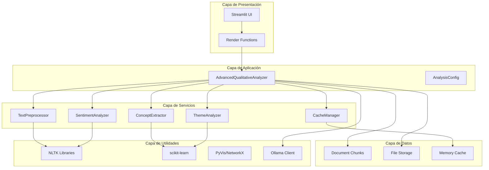
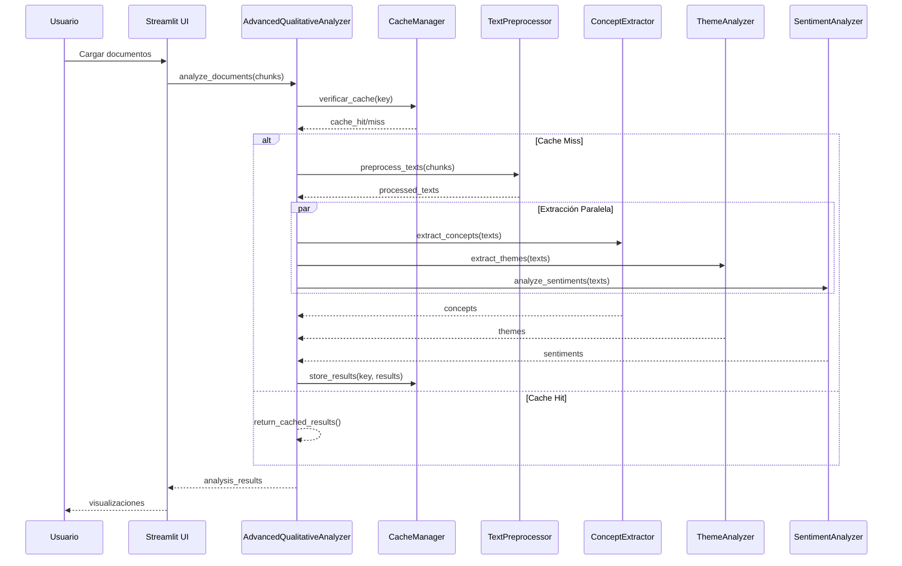
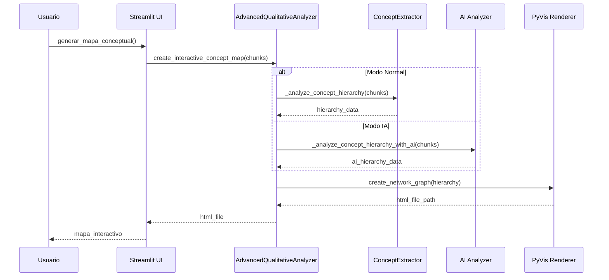

# 🏗️ Arquitectura Técnica del Módulo de Análisis Cualitativo

## 📋 Tabla de Contenidos

1. [Visión General](#visión-general)
2. [Arquitectura de Alto Nivel](#arquitectura-de-alto-nivel)
3. [Componentes del Sistema](#componentes-del-sistema)
4. [Flujo de Datos](#flujo-de-datos)
5. [Patrones de Diseño](#patrones-de-diseño)
6. [Gestión de Memoria y Cache](#gestión-de-memoria-y-cache)
7. [Procesamiento Paralelo](#procesamiento-paralelo)
8. [Sistema de Configuración](#sistema-de-configuración)
9. [Manejo de Errores](#manejo-de-errores)
10. [Métricas y Monitoreo](#métricas-y-monitoreo)

---

## 🎯 Visión General

El módulo de análisis cualitativo implementa una **arquitectura modular y escalable** que separa las responsabilidades en componentes especializados, permitiendo:

- ✅ **Mantenibilidad** mejorada
- ✅ **Testabilidad** individual de componentes
- ✅ **Escalabilidad** horizontal y vertical
- ✅ **Reutilización** de código
- ✅ **Extensibilidad** para nuevas funcionalidades

### 🎨 Principios Arquitectónicos

1. **Separación de Responsabilidades**: Cada clase tiene una responsabilidad específica
2. **Inversión de Dependencias**: Uso de interfaces y abstracciones
3. **Composición sobre Herencia**: Preferencia por composición
4. **Configuración Externa**: Parámetros configurables
5. **Cache Inteligente**: Optimización de rendimiento
6. **Procesamiento Paralelo**: Utilización eficiente de recursos

---

## 🏛️ Arquitectura de Alto Nivel



---

## 🔧 Componentes del Sistema

### 📊 **1. Clases Base y Abstracciones**

#### **BaseAnalyzer**
```python
from abc import ABC, abstractmethod
from dataclasses import dataclass

@dataclass
class AnalysisConfig:
    min_frequency: int = 2
    max_concepts: int = 50
    similarity_threshold: float = 0.6
    enable_cache: bool = True
    parallel_processing: bool = True

class BaseAnalyzer(ABC):
    def __init__(self, config: AnalysisConfig):
        self.config = config
        self.logger = setup_logger()
    
    @abstractmethod
    def analyze(self, chunks: List[Dict]) -> AnalysisResult:
        """Realizar análisis específico"""
        pass
    
    def _validate_input(self, chunks: List[Dict]) -> bool:
        """Validar entrada de datos"""
        return bool(chunks and all('content' in chunk for chunk in chunks))
```

**Responsabilidades:**
- ✅ Definir interfaz común para todos los analizadores
- ✅ Validación de entrada estándar
- ✅ Configuración compartida
- ✅ Logging unificado

### 📝 **2. TextPreprocessor**

```python
class TextPreprocessor:
    def __init__(self):
        self.stopwords_cache = None
        self.logger = logger
    
    def get_spanish_stopwords(self) -> List[str]:
        """Obtener stopwords en español con cache"""
        if self.stopwords_cache is None:
            # Descargar si no existe
            nltk.download('stopwords', quiet=True)
            
            # Obtener stopwords en español
            spanish_stopwords = set(stopwords.words('spanish'))
            
            # Agregar stopwords personalizados
            custom_stopwords = {
                'también', 'puede', 'ser', 'está', 'han', 'más', 'menos',
                'año', 'años', 'vez', 'caso', 'parte', 'lugar', 'momento',
                'tiempo', 'persona', 'personas', 'gente', 'mundo', 'vida'
            }
            
            self.stopwords_cache = spanish_stopwords | custom_stopwords
        
        return list(self.stopwords_cache)
    
    def preprocess_text(self, text: str) -> str:
        """Preprocesar texto completo"""
        if not text:
            return ""
        
        # Convertir a minúsculas
        text = text.lower()
        
        # Remover caracteres especiales pero mantener espacios
        text = re.sub(r'[^\w\s]', ' ', text)
        
        # Remover números
        text = re.sub(r'\d+', '', text)
        
        # Remover espacios múltiples
        text = re.sub(r'\s+', ' ', text)
        
        # Obtener stopwords
        stopwords_list = self.get_spanish_stopwords()
        
        # Filtrar stopwords
        words = text.split()
        filtered_words = [word for word in words if word not in stopwords_list and len(word) > 2]
        
        return ' '.join(filtered_words)
```

**Responsabilidades:**
- ✅ Limpieza de texto
- ✅ Gestión de stopwords
- ✅ Normalización de formato
- ✅ Cache de recursos NLTK

### 🔍 **3. ConceptExtractor**

```python
class ConceptExtractor(BaseAnalyzer):
    def __init__(self, config: AnalysisConfig):
        super().__init__(config)
        self.tfidf_vectorizers_cache = {}
    
    def analyze(self, chunks: List[Dict]) -> AnalysisResult:
        """Análisis principal de extracción de conceptos"""
        if not self._validate_input(chunks):
            return AnalysisResult(
                analysis_type=AnalysisType.CONCEPT_EXTRACTION,
                data={'concepts': []},
                metadata={'error': 'Input validation failed'}
            )
        
        try:
            # Generar clave de cache
            cache_key = self._generate_cache_key(chunks)
            
            # Verificar cache
            if self.config.enable_cache and cache_key in self._concept_cache:
                cached_result = self._concept_cache[cache_key]
                logger.info(f"Conceptos recuperados del cache: {len(cached_result)}")
                return AnalysisResult(
                    analysis_type=AnalysisType.CONCEPT_EXTRACTION,
                    data={'concepts': cached_result},
                    metadata={'cached': True}
                )
            
            # Extraer conceptos
            concepts = self._extract_concepts_advanced(chunks)
            
            # Guardar en cache
            if self.config.enable_cache:
                self._concept_cache[cache_key] = concepts
            
            return AnalysisResult(
                analysis_type=AnalysisType.CONCEPT_EXTRACTION,
                data={'concepts': concepts},
                metadata={'total_concepts': len(concepts)}
            )
            
        except Exception as e:
            logger.error(f"Error en extracción de conceptos: {e}")
            return AnalysisResult(
                analysis_type=AnalysisType.CONCEPT_EXTRACTION,
                data={'concepts': []},
                metadata={'error': str(e)}
            )
    
    def _extract_concepts_advanced(self, chunks: List[Dict]) -> List[ConceptData]:
        """Extracción avanzada combinando múltiples métodos"""
        texts = [chunk['content'] for chunk in chunks]
        
        # Método 1: TF-IDF
        tfidf_concepts = self._extract_with_tfidf(texts)
        
        # Método 2: Frecuencia
        frequency_concepts = self._extract_with_frequency(texts)
        
        # Combinar y enriquecer
        all_concepts = tfidf_concepts + frequency_concepts
        
        # Enriquecer con contexto
        enriched_concepts = self._enrich_concepts_with_context(all_concepts, chunks)
        
        # Ordenar por score
        enriched_concepts.sort(key=lambda x: x.score, reverse=True)
        
        return enriched_concepts[:self.config.max_concepts]
```

**Responsabilidades:**
- ✅ Extracción de conceptos con TF-IDF
- ✅ Análisis de frecuencia
- ✅ Enriquecimiento con contexto
- ✅ Cache de vectorizadores

### 🎯 **4. ThemeAnalyzer**

```python
class ThemeAnalyzer(BaseAnalyzer):
    def __init__(self, config: AnalysisConfig):
        super().__init__(config)
        self.lda_models_cache = {}
    
    def analyze(self, chunks: List[Dict]) -> AnalysisResult:
        """Análisis principal de temas"""
        try:
            cache_key = self._generate_cache_key(chunks)
            
            # Verificar cache
            if self.config.enable_cache and cache_key in self._theme_cache:
                cached_themes = self._theme_cache[cache_key]
                return AnalysisResult(
                    analysis_type=AnalysisType.THEME_ANALYSIS,
                    data={'themes': cached_themes},
                    metadata={'cached': True}
                )
            
            # Extraer temas
            themes = self._extract_themes_advanced(chunks)
            
            # Guardar en cache
            if self.config.enable_cache:
                self._theme_cache[cache_key] = themes
            
            return AnalysisResult(
                analysis_type=AnalysisType.THEME_ANALYSIS,
                data={'themes': themes},
                metadata={'total_themes': len(themes)}
            )
            
        except Exception as e:
            logger.error(f"Error en análisis de temas: {e}")
            return AnalysisResult(
                analysis_type=AnalysisType.THEME_ANALYSIS,
                data={'themes': []},
                metadata={'error': str(e)}
            )
    
    def _extract_themes_with_lda(self, texts: List[str]) -> List[Dict]:
        """Extracción de temas usando LDA"""
        # Preprocesar textos
        preprocessed_texts = [self._preprocess_text(text) for text in texts]
        
        # Crear vectorizador TF-IDF
        vectorizer = TfidfVectorizer(
            max_features=1000,
            stop_words=self._get_spanish_stopwords(),
            ngram_range=(1, 2)
        )
        
        # Vectorizar textos
        tfidf_matrix = vectorizer.fit_transform(preprocessed_texts)
        
        # Crear modelo LDA
        lda_model = LatentDirichletAllocation(
            n_components=min(10, len(texts)),
            random_state=42,
            max_iter=100
        )
        
        # Entrenar modelo
        lda_model.fit(tfidf_matrix)
        
        # Extraer temas
        feature_names = vectorizer.get_feature_names_out()
        topics = []
        
        for topic_idx, topic in enumerate(lda_model.components_):
            top_words_idx = topic.argsort()[-10:][::-1]
            top_words = [feature_names[i] for i in top_words_idx]
            
            # Calcular coherencia del tema
            coherence = self._calculate_topic_coherence(top_words, preprocessed_texts)
            
            topics.append({
                'topic_id': topic_idx,
                'words': top_words,
                'coherence': coherence,
                'description': self._generate_theme_description(top_words)
            })
        
        return topics
```

**Responsabilidades:**
- ✅ Análisis LDA de temas
- ✅ Clustering jerárquico
- ✅ Cálculo de coherencia
- ✅ Generación de descripciones

### 😊 **5. SentimentAnalyzer**

```python
class SentimentAnalyzer(BaseAnalyzer):
    def __init__(self, config: AnalysisConfig):
        super().__init__(config)
        self.vader_analyzer = SentimentIntensityAnalyzer()
    
    def analyze(self, chunks: List[Dict]) -> AnalysisResult:
        """Análisis principal de sentimientos"""
        try:
            cache_key = self._generate_cache_key(chunks)
            
            # Verificar cache
            if self.config.enable_cache and cache_key in self._sentiment_cache:
                cached_sentiment = self._sentiment_cache[cache_key]
                return AnalysisResult(
                    analysis_type=AnalysisType.SENTIMENT_ANALYSIS,
                    data={'sentiment': cached_sentiment},
                    metadata={'cached': True}
                )
            
            # Analizar sentimientos
            sentiment_data = self._analyze_sentiments_advanced(chunks)
            
            # Guardar en cache
            if self.config.enable_cache:
                self._sentiment_cache[cache_key] = sentiment_data
            
            return AnalysisResult(
                analysis_type=AnalysisType.SENTIMENT_ANALYSIS,
                data={'sentiment': sentiment_data},
                metadata={'chunks_analyzed': len(chunks)}
            )
            
        except Exception as e:
            logger.error(f"Error en análisis de sentimientos: {e}")
            return AnalysisResult(
                analysis_type=AnalysisType.SENTIMENT_ANALYSIS,
                data={'sentiment': {}},
                metadata={'error': str(e)}
            )
    
    def _analyze_with_textblob_vader(self, chunks: List[Dict]) -> Dict:
        """Análisis combinado con TextBlob y VADER"""
        results = {
            'overall_sentiment': {},
            'chunk_sentiments': [],
            'sentiment_distribution': {},
            'trends': []
        }
        
        all_polarities = []
        all_subjectivities = []
        all_compound_scores = []
        
        for chunk in chunks:
            text = chunk.get('content', '')
            
            # TextBlob
            blob = TextBlob(text)
            polarity = blob.sentiment.polarity
            subjectivity = blob.sentiment.subjectivity
            
            # VADER
            vader_scores = self.vader_analyzer.polarity_scores(text)
            compound = vader_scores['compound']
            
            # Clasificar sentimiento
            if compound >= 0.05:
                sentiment_label = 'positive'
            elif compound <= -0.05:
                sentiment_label = 'negative'
            else:
                sentiment_label = 'neutral'
            
            chunk_sentiment = {
                'chunk_id': chunk.get('chunk_id', 0),
                'source': chunk.get('metadata', {}).get('source_file', 'unknown'),
                'text_preview': text[:100] + '...',
                'textblob': {
                    'polarity': polarity,
                    'subjectivity': subjectivity
                },
                'vader': vader_scores,
                'combined_sentiment': sentiment_label,
                'confidence': abs(compound)
            }
            
            results['chunk_sentiments'].append(chunk_sentiment)
            
            all_polarities.append(polarity)
            all_subjectivities.append(subjectivity)
            all_compound_scores.append(compound)
        
        # Calcular sentimiento general
        avg_polarity = sum(all_polarities) / len(all_polarities) if all_polarities else 0
        avg_subjectivity = sum(all_subjectivities) / len(all_subjectivities) if all_subjectivities else 0
        avg_compound = sum(all_compound_scores) / len(all_compound_scores) if all_compound_scores else 0
        
        # Clasificar sentimiento general
        if avg_compound >= 0.05:
            overall_label = 'positive'
        elif avg_compound <= -0.05:
            overall_label = 'negative'
        else:
            overall_label = 'neutral'
        
        results['overall_sentiment'] = {
            'label': overall_label,
            'polarity': avg_polarity,
            'subjectivity': avg_subjectivity,
            'compound': avg_compound,
            'confidence': abs(avg_compound)
        }
        
        # Distribución de sentimientos
        sentiment_counts = {}
        for chunk_sentiment in results['chunk_sentiments']:
            sentiment = chunk_sentiment['combined_sentiment']
            sentiment_counts[sentiment] = sentiment_counts.get(sentiment, 0) + 1
        
        total_chunks = len(results['chunk_sentiments'])
        results['sentiment_distribution'] = {
            sentiment: count / total_chunks 
            for sentiment, count in sentiment_counts.items()
        }
        
        # Calcular tendencias
        results['trends'] = self._calculate_sentiment_trends(results['chunk_sentiments'])
        
        return results
```

**Responsabilidades:**
- ✅ Análisis con TextBlob
- ✅ Análisis con VADER
- ✅ Combinación de resultados
- ✅ Cálculo de tendencias

### 💾 **6. CacheManager**

```python
class CacheManager:
    def __init__(self, max_size: int = 1000):
        self.cache = {}
        self.access_times = {}
        self.max_size = max_size
        self.hits = 0
        self.misses = 0
        self.lock = threading.Lock()
    
    def get(self, key: str) -> Optional[Any]:
        """Obtener valor del cache"""
        with self.lock:
            if key in self.cache:
                self.access_times[key] = time.time()
                self.hits += 1
                return self.cache[key]
            else:
                self.misses += 1
                return None
    
    def set(self, key: str, value: Any) -> None:
        """Establecer valor en el cache"""
        with self.lock:
            # Si el cache está lleno, eliminar el más antiguo
            if len(self.cache) >= self.max_size and key not in self.cache:
                self._evict_oldest()
            
            self.cache[key] = value
            self.access_times[key] = time.time()
    
    def _evict_oldest(self) -> None:
        """Eliminar la entrada más antigua"""
        if not self.access_times:
            return
        
        oldest_key = min(self.access_times.keys(), key=lambda k: self.access_times[k])
        del self.cache[oldest_key]
        del self.access_times[oldest_key]
    
    def clear(self) -> None:
        """Limpiar todo el cache"""
        with self.lock:
            self.cache.clear()
            self.access_times.clear()
            self.hits = 0
            self.misses = 0
    
    def get_stats(self) -> Dict[str, Any]:
        """Obtener estadísticas del cache"""
        total_requests = self.hits + self.misses
        hit_rate = self.hits / total_requests if total_requests > 0 else 0
        
        return {
            'size': len(self.cache),
            'max_size': self.max_size,
            'hits': self.hits,
            'misses': self.misses,
            'hit_rate': hit_rate,
            'memory_usage': sum(len(str(v)) for v in self.cache.values())
        }
```

**Responsabilidades:**
- ✅ Gestión de cache thread-safe
- ✅ Evicción LRU (Least Recently Used)
- ✅ Estadísticas de rendimiento
- ✅ Control de tamaño

---

## 🔄 Flujo de Datos

### 📊 **Flujo Principal de Análisis**



### 🗺️ **Flujo de Visualización**



---

## 🎨 Patrones de Diseño

### 1. **Patrón Strategy**

```python
class AnalysisStrategy(ABC):
    @abstractmethod
    def analyze(self, data: Any) -> Any:
        pass

class TFIDFStrategy(AnalysisStrategy):
    def analyze(self, texts: List[str]) -> List[Dict]:
        # Implementación TF-IDF
        pass

class FrequencyStrategy(AnalysisStrategy):
    def analyze(self, texts: List[str]) -> List[Dict]:
        # Implementación por frecuencia
        pass

class ConceptExtractor:
    def __init__(self):
        self.strategies = {
            'tfidf': TFIDFStrategy(),
            'frequency': FrequencyStrategy()
        }
    
    def extract_concepts(self, texts: List[str], strategy: str = 'tfidf'):
        return self.strategies[strategy].analyze(texts)
```

### 2. **Patrón Factory**

```python
class AnalyzerFactory:
    @staticmethod
    def create_analyzer(analyzer_type: str, config: AnalysisConfig) -> BaseAnalyzer:
        analyzers = {
            'concept': ConceptExtractor,
            'theme': ThemeAnalyzer,
            'sentiment': SentimentAnalyzer
        }
        
        if analyzer_type not in analyzers:
            raise ValueError(f"Tipo de analizador no soportado: {analyzer_type}")
        
        return analyzers[analyzer_type](config)
```

### 3. **Patrón Observer**

```python
class AnalysisObserver(ABC):
    @abstractmethod
    def update(self, event: str, data: Any) -> None:
        pass

class MetricsObserver(AnalysisObserver):
    def update(self, event: str, data: Any) -> None:
        if event == 'analysis_completed':
            self.record_metrics(data)

class CacheObserver(AnalysisObserver):
    def update(self, event: str, data: Any) -> None:
        if event == 'analysis_completed':
            self.cache_results(data)

class AdvancedQualitativeAnalyzer:
    def __init__(self):
        self.observers = []
    
    def add_observer(self, observer: AnalysisObserver):
        self.observers.append(observer)
    
    def notify_observers(self, event: str, data: Any):
        for observer in self.observers:
            observer.update(event, data)
```

---

## 💾 Gestión de Memoria y Cache

### 🗄️ **Estrategia de Cache Multi-Nivel**

```python
class MultiLevelCache:
    def __init__(self):
        self.l1_cache = {}  # Cache en memoria (rápido)
        self.l2_cache = {}  # Cache en disco (persistente)
        self.access_patterns = {}
    
    def get(self, key: str) -> Optional[Any]:
        # L1 Cache (memoria)
        if key in self.l1_cache:
            self.access_patterns[key] = time.time()
            return self.l1_cache[key]
        
        # L2 Cache (disco)
        if key in self.l2_cache:
            value = self.l2_cache[key]
            self.l1_cache[key] = value  # Promover a L1
            self.access_patterns[key] = time.time()
            return value
        
        return None
    
    def set(self, key: str, value: Any, level: str = 'l1'):
        if level == 'l1':
            self.l1_cache[key] = value
        else:
            self.l2_cache[key] = value
        
        self.access_patterns[key] = time.time()
```

### 📊 **Gestión de Memoria Inteligente**

```python
class MemoryManager:
    def __init__(self, max_memory_mb: int = 512):
        self.max_memory_bytes = max_memory_mb * 1024 * 1024
        self.current_usage = 0
        self.object_sizes = {}
    
    def can_allocate(self, size: int) -> bool:
        return self.current_usage + size <= self.max_memory_bytes
    
    def allocate(self, obj_id: str, obj: Any) -> bool:
        obj_size = sys.getsizeof(obj)
        
        if not self.can_allocate(obj_size):
            self._free_memory(obj_size)
        
        if self.can_allocate(obj_size):
            self.object_sizes[obj_id] = obj_size
            self.current_usage += obj_size
            return True
        
        return False
    
    def _free_memory(self, required_size: int):
        # Liberar objetos menos usados
        sorted_objects = sorted(
            self.object_sizes.items(),
            key=lambda x: x[1],
            reverse=True
        )
        
        freed_size = 0
        for obj_id, size in sorted_objects:
            if freed_size >= required_size:
                break
            
            # Marcar para liberación
            if obj_id in self.cache:
                del self.cache[obj_id]
            
            del self.object_sizes[obj_id]
            self.current_usage -= size
            freed_size += size
```

---

## ⚡ Procesamiento Paralelo

### 🔄 **ThreadPoolExecutor para Análisis Concurrente**

```python
from concurrent.futures import ThreadPoolExecutor, as_completed
import threading

class ParallelAnalyzer:
    def __init__(self, max_workers: int = 4):
        self.max_workers = max_workers
        self.thread_local = threading.local()
    
    def perform_parallel_analysis(self, chunks: List[Dict], analysis_types: List[AnalysisType]) -> Dict[str, AnalysisResult]:
        """Ejecutar múltiples análisis en paralelo"""
        results = {}
        
        with ThreadPoolExecutor(max_workers=self.max_workers) as executor:
            # Crear tareas
            future_to_type = {}
            
            for analysis_type in analysis_types:
                if analysis_type == AnalysisType.CONCEPT_EXTRACTION:
                    future = executor.submit(self._analyze_concepts, chunks)
                elif analysis_type == AnalysisType.THEME_ANALYSIS:
                    future = executor.submit(self._analyze_themes, chunks)
                elif analysis_type == AnalysisType.SENTIMENT_ANALYSIS:
                    future = executor.submit(self._analyze_sentiments, chunks)
                
                future_to_type[future] = analysis_type
            
            # Recoger resultados
            for future in as_completed(future_to_type):
                analysis_type = future_to_type[future]
                try:
                    result = future.result()
                    results[analysis_type.value] = result
                except Exception as e:
                    logger.error(f"Error en análisis {analysis_type}: {e}")
                    results[analysis_type.value] = AnalysisResult(
                        analysis_type=analysis_type,
                        data={},
                        metadata={'error': str(e)}
                    )
        
        return results
    
    def _get_analyzer_instance(self, analyzer_type: str):
        """Obtener instancia thread-safe del analizador"""
        if not hasattr(self.thread_local, 'analyzers'):
            self.thread_local.analyzers = {}
        
        if analyzer_type not in self.thread_local.analyzers:
            config = AnalysisConfig()
            self.thread_local.analyzers[analyzer_type] = AnalyzerFactory.create_analyzer(analyzer_type, config)
        
        return self.thread_local.analyzers[analyzer_type]
```

### 🔀 **Procesamiento en Lotes**

```python
class BatchProcessor:
    def __init__(self, batch_size: int = 100):
        self.batch_size = batch_size
    
    def process_in_batches(self, chunks: List[Dict], processor_func) -> List[Any]:
        """Procesar chunks en lotes para optimizar memoria"""
        results = []
        
        for i in range(0, len(chunks), self.batch_size):
            batch = chunks[i:i + self.batch_size]
            batch_results = processor_func(batch)
            results.extend(batch_results)
            
            # Liberar memoria del lote
            del batch
        
        return results
    
    def process_with_memory_management(self, chunks: List[Dict], processor_func) -> List[Any]:
        """Procesar con gestión automática de memoria"""
        memory_manager = MemoryManager()
        results = []
        
        for i in range(0, len(chunks), self.batch_size):
            batch = chunks[i:i + self.batch_size]
            
            # Verificar memoria disponible
            batch_size_estimate = len(str(batch)) * 10  # Estimación
            
            if not memory_manager.can_allocate(batch_size_estimate):
                memory_manager._free_memory(batch_size_estimate)
            
            # Procesar lote
            batch_results = processor_func(batch)
            results.extend(batch_results)
            
            # Registrar en gestor de memoria
            memory_manager.allocate(f"batch_{i}", batch_results)
            
            # Liberar lote
            del batch
        
        return results
```

---

## ⚙️ Sistema de Configuración

### 🔧 **Configuración Jerárquica**

```python
from dataclasses import dataclass, field
from typing import Dict, Any, Optional
import json
import os

@dataclass
class AnalysisConfig:
    # Configuración básica
    min_frequency: int = 2
    max_concepts: int = 50
    similarity_threshold: float = 0.6
    
    # Configuración de cache
    enable_cache: bool = True
    cache_size: int = 1000
    cache_ttl: int = 3600  # segundos
    
    # Configuración de procesamiento
    parallel_processing: bool = True
    max_workers: int = 4
    batch_size: int = 100
    
    # Configuración de análisis
    n_topics: int = 10
    n_clusters: int = 5
    chunk_size: int = 2000
    chunk_overlap: int = 300
    
    # Configuración de visualización
    default_layout: str = "spring"
    node_spacing: int = 350
    physics_strength: float = 0.8
    
    # Configuración personalizada
    custom_settings: Dict[str, Any] = field(default_factory=dict)
    
    @classmethod
    def from_file(cls, config_file: str) -> 'AnalysisConfig':
        """Cargar configuración desde archivo"""
        if os.path.exists(config_file):
            with open(config_file, 'r') as f:
                config_data = json.load(f)
            return cls(**config_data)
        return cls()
    
    def save_to_file(self, config_file: str) -> None:
        """Guardar configuración a archivo"""
        config_dict = {
            field.name: getattr(self, field.name) 
            for field in self.__dataclass_fields__.values()
        }
        
        with open(config_file, 'w') as f:
            json.dump(config_dict, f, indent=2)
    
    def update_from_dict(self, updates: Dict[str, Any]) -> None:
        """Actualizar configuración desde diccionario"""
        for key, value in updates.items():
            if hasattr(self, key):
                setattr(self, key, value)
            else:
                self.custom_settings[key] = value
    
    def get_effective_config(self, override: Optional[Dict[str, Any]] = None) -> Dict[str, Any]:
        """Obtener configuración efectiva con overrides"""
        config_dict = {
            field.name: getattr(self, field.name) 
            for field in self.__dataclass_fields__.values()
        }
        
        if override:
            config_dict.update(override)
        
        return config_dict
```

### 🔄 **Configuración Dinámica**

```python
class ConfigManager:
    def __init__(self):
        self.config = AnalysisConfig()
        self.config_file = "config/analysis_config.json"
        self.watchers = []
    
    def load_config(self) -> AnalysisConfig:
        """Cargar configuración desde archivo"""
        if os.path.exists(self.config_file):
            self.config = AnalysisConfig.from_file(self.config_file)
        return self.config
    
    def save_config(self) -> None:
        """Guardar configuración actual"""
        self.config.save_to_file(self.config_file)
    
    def update_config(self, updates: Dict[str, Any]) -> None:
        """Actualizar configuración y notificar watchers"""
        old_config = self.config
        self.config.update_from_dict(updates)
        
        # Notificar cambios
        for watcher in self.watchers:
            watcher.on_config_changed(old_config, self.config)
    
    def add_config_watcher(self, watcher):
        """Agregar observador de cambios de configuración"""
        self.watchers.append(watcher)
    
    def get_config_value(self, key: str, default: Any = None) -> Any:
        """Obtener valor de configuración con fallback"""
        if hasattr(self.config, key):
            return getattr(self.config, key)
        return self.config.custom_settings.get(key, default)
```

---

## 🚨 Manejo de Errores

### 🛡️ **Sistema de Manejo de Errores Robusto**

```python
import logging
from typing import Optional, Callable, Any
from functools import wraps
import traceback

class ErrorHandler:
    def __init__(self):
        self.logger = logging.getLogger(__name__)
        self.error_counts = {}
        self.last_errors = {}
    
    def handle_error(self, error: Exception, context: str = "", 
                    reraise: bool = False, fallback_value: Any = None) -> Any:
        """Manejar error con contexto y logging"""
        error_type = type(error).__name__
        error_msg = str(error)
        
        # Incrementar contador de errores
        self.error_counts[error_type] = self.error_counts.get(error_type, 0) + 1
        
        # Guardar último error
        self.last_errors[error_type] = {
            'message': error_msg,
            'context': context,
            'timestamp': time.time(),
            'traceback': traceback.format_exc()
        }
        
        # Log del error
        self.logger.error(f"Error en {context}: {error_type} - {error_msg}")
        
        # Log detallado si es necesario
        if self.logger.isEnabledFor(logging.DEBUG):
            self.logger.debug(f"Traceback: {traceback.format_exc()}")
        
        if reraise:
            raise error
        
        return fallback_value
    
    def get_error_stats(self) -> Dict[str, Any]:
        """Obtener estadísticas de errores"""
        return {
            'total_errors': sum(self.error_counts.values()),
            'error_types': self.error_counts,
            'last_errors': self.last_errors
        }
    
    def clear_errors(self) -> None:
        """Limpiar historial de errores"""
        self.error_counts.clear()
        self.last_errors.clear()

def error_handler_decorator(fallback_value: Any = None, context: str = ""):
    """Decorador para manejo automático de errores"""
    def decorator(func: Callable) -> Callable:
        @wraps(func)
        def wrapper(*args, **kwargs):
            try:
                return func(*args, **kwargs)
            except Exception as e:
                error_handler = ErrorHandler()
                return error_handler.handle_error(
                    e, 
                    context or func.__name__, 
                    reraise=False, 
                    fallback_value=fallback_value
                )
        return wrapper
    return decorator

# Uso del decorador
@error_handler_decorator(fallback_value=[], context="extracción de conceptos")
def extract_concepts_safe(chunks):
    # Código que puede fallar
    return extract_concepts(chunks)
```

### 🔄 **Recuperación Automática**

```python
class ResilientAnalyzer:
    def __init__(self, max_retries: int = 3, backoff_factor: float = 1.0):
        self.max_retries = max_retries
        self.backoff_factor = backoff_factor
        self.error_handler = ErrorHandler()
    
    def analyze_with_retry(self, chunks: List[Dict], analysis_func: Callable) -> Any:
        """Ejecutar análisis con reintentos automáticos"""
        last_error = None
        
        for attempt in range(self.max_retries):
            try:
                return analysis_func(chunks)
            except Exception as e:
                last_error = e
                
                if attempt < self.max_retries - 1:
                    # Esperar antes del siguiente intento
                    wait_time = self.backoff_factor * (2 ** attempt)
                    time.sleep(wait_time)
                    
                    self.error_handler.logger.warning(
                        f"Intento {attempt + 1} falló, reintentando en {wait_time}s: {e}"
                    )
                else:
                    self.error_handler.logger.error(f"Todos los intentos fallaron: {e}")
        
        # Si todos los intentos fallaron, devolver valor por defecto
        return self.error_handler.handle_error(
            last_error, 
            "análisis con reintentos", 
            fallback_value={}
        )
    
    def analyze_with_fallback(self, chunks: List[Dict]) -> Dict[str, Any]:
        """Análisis con múltiples métodos de fallback"""
        methods = [
            ("advanced", self._analyze_advanced),
            ("basic", self._analyze_basic),
            ("legacy", self._analyze_legacy)
        ]
        
        for method_name, method_func in methods:
            try:
                result = method_func(chunks)
                if result:  # Si el resultado es válido
                    self.error_handler.logger.info(f"Análisis exitoso con método: {method_name}")
                    return result
            except Exception as e:
                self.error_handler.logger.warning(f"Método {method_name} falló: {e}")
                continue
        
        # Si todos los métodos fallaron
        return self.error_handler.handle_error(
            Exception("Todos los métodos de análisis fallaron"),
            "análisis con fallback",
            fallback_value={'error': 'No se pudo completar el análisis'}
        )
```

---

## 📊 Métricas y Monitoreo

### 📈 **Sistema de Métricas Completo**

```python
import time
from dataclasses import dataclass, field
from typing import Dict, List, Any
from collections import defaultdict, deque
import threading

@dataclass
class PerformanceMetrics:
    """Métricas de rendimiento del análisis"""
    start_time: float = field(default_factory=time.time)
    end_time: Optional[float] = None
    processing_time: float = 0.0
    memory_usage: float = 0.0
    cpu_usage: float = 0.0
    cache_hits: int = 0
    cache_misses: int = 0
    chunks_processed: int = 0
    concepts_extracted: int = 0
    errors_count: int = 0
    
    def finish(self):
        """Finalizar medición de métricas"""
        self.end_time = time.time()
        self.processing_time = self.end_time - self.start_time

class MetricsCollector:
    def __init__(self, history_size: int = 1000):
        self.history_size = history_size
        self.metrics_history = deque(maxlen=history_size)
        self.current_metrics = {}
        self.lock = threading.Lock()
        
        # Métricas acumulativas
        self.total_analyses = 0
        self.total_processing_time = 0.0
        self.total_concepts = 0
        self.total_errors = 0
        
        # Métricas por tipo de análisis
        self.analysis_type_metrics = defaultdict(lambda: {
            'count': 0,
            'total_time': 0.0,
            'avg_time': 0.0,
            'success_rate': 0.0
        })
    
    def start_analysis(self, analysis_type: str, chunks_count: int) -> str:
        """Iniciar medición de análisis"""
        analysis_id = f"{analysis_type}_{int(time.time() * 1000)}"
        
        with self.lock:
            self.current_metrics[analysis_id] = PerformanceMetrics()
            self.current_metrics[analysis_id].chunks_processed = chunks_count
        
        return analysis_id
    
    def finish_analysis(self, analysis_id: str, success: bool = True, 
                       concepts_count: int = 0, errors_count: int = 0):
        """Finalizar medición de análisis"""
        with self.lock:
            if analysis_id in self.current_metrics:
                metrics = self.current_metrics[analysis_id]
                metrics.finish()
                metrics.concepts_extracted = concepts_count
                metrics.errors_count = errors_count
                
                # Agregar a historial
                self.metrics_history.append(metrics)
                
                # Actualizar métricas acumulativas
                self.total_analyses += 1
                self.total_processing_time += metrics.processing_time
                self.total_concepts += concepts_count
                self.total_errors += errors_count
                
                # Actualizar métricas por tipo
                analysis_type = analysis_id.split('_')[0]
                type_metrics = self.analysis_type_metrics[analysis_type]
                type_metrics['count'] += 1
                type_metrics['total_time'] += metrics.processing_time
                type_metrics['avg_time'] = type_metrics['total_time'] / type_metrics['count']
                type_metrics['success_rate'] = (type_metrics['success_rate'] * (type_metrics['count'] - 1) + 
                                               (1 if success else 0)) / type_metrics['count']
                
                # Remover de métricas actuales
                del self.current_metrics[analysis_id]
    
    def get_summary_metrics(self) -> Dict[str, Any]:
        """Obtener métricas resumidas"""
        with self.lock:
            avg_processing_time = (self.total_processing_time / self.total_analyses 
                                 if self.total_analyses > 0 else 0)
            
            return {
                'total_analyses': self.total_analyses,
                'avg_processing_time': avg_processing_time,
                'total_concepts_extracted': self.total_concepts,
                'total_errors': self.total_errors,
                'error_rate': self.total_errors / self.total_analyses if self.total_analyses > 0 else 0,
                'analysis_types': dict(self.analysis_type_metrics),
                'recent_metrics': list(self.metrics_history)[-10:] if self.metrics_history else []
            }
    
    def get_performance_trends(self, window_size: int = 50) -> Dict[str, List[float]]:
        """Obtener tendencias de rendimiento"""
        with self.lock:
            recent_metrics = list(self.metrics_history)[-window_size:]
            
            if not recent_metrics:
                return {}
            
            return {
                'processing_times': [m.processing_time for m in recent_metrics],
                'concepts_per_analysis': [m.concepts_extracted for m in recent_metrics],
                'cache_hit_rates': [m.cache_hits / (m.cache_hits + m.cache_misses) 
                                  if (m.cache_hits + m.cache_misses) > 0 else 0 
                                  for m in recent_metrics],
                'timestamps': [m.start_time for m in recent_metrics]
            }
```

### 📊 **Dashboard de Métricas**

```python
class MetricsDashboard:
    def __init__(self, metrics_collector: MetricsCollector):
        self.metrics_collector = metrics_collector
    
    def render_dashboard(self):
        """Renderizar dashboard de métricas en Streamlit"""
        st.header("📊 Dashboard de Métricas del Análisis Cualitativo")
        
        # Métricas generales
        summary = self.metrics_collector.get_summary_metrics()
        
        col1, col2, col3, col4 = st.columns(4)
        
        with col1:
            st.metric("Total Análisis", summary['total_analyses'])
        
        with col2:
            st.metric("Tiempo Promedio", f"{summary['avg_processing_time']:.2f}s")
        
        with col3:
            st.metric("Conceptos Extraídos", summary['total_concepts_extracted'])
        
        with col4:
            st.metric("Tasa de Error", f"{summary['error_rate']:.2%}")
        
        # Gráficos de tendencias
        trends = self.metrics_collector.get_performance_trends()
        
        if trends:
            st.subheader("📈 Tendencias de Rendimiento")
            
            # Gráfico de tiempos de procesamiento
            fig = go.Figure()
            fig.add_trace(go.Scatter(
                x=trends['timestamps'],
                y=trends['processing_times'],
                mode='lines+markers',
                name='Tiempo de Procesamiento'
            ))
            fig.update_layout(
                title="Tiempo de Procesamiento por Análisis",
                xaxis_title="Tiempo",
                yaxis_title="Segundos"
            )
            st.plotly_chart(fig, use_container_width=True)
            
            # Gráfico de conceptos extraídos
            fig2 = go.Figure()
            fig2.add_trace(go.Scatter(
                x=trends['timestamps'],
                y=trends['concepts_per_analysis'],
                mode='lines+markers',
                name='Conceptos por Análisis'
            ))
            fig2.update_layout(
                title="Conceptos Extraídos por Análisis",
                xaxis_title="Tiempo",
                yaxis_title="Número de Conceptos"
            )
            st.plotly_chart(fig2, use_container_width=True)
        
        # Métricas por tipo de análisis
        st.subheader("📊 Métricas por Tipo de Análisis")
        
        for analysis_type, metrics in summary['analysis_types'].items():
            with st.expander(f"🔍 {analysis_type.title()}"):
                col1, col2, col3, col4 = st.columns(4)
                
                with col1:
                    st.metric("Análisis Realizados", metrics['count'])
                
                with col2:
                    st.metric("Tiempo Promedio", f"{metrics['avg_time']:.2f}s")
                
                with col3:
                    st.metric("Tiempo Total", f"{metrics['total_time']:.2f}s")
                
                with col4:
                    st.metric("Tasa de Éxito", f"{metrics['success_rate']:.2%}")
```

---

## 🎯 Conclusiones

La arquitectura del módulo de análisis cualitativo implementa un diseño robusto, escalable y mantenible que:

### ✅ **Fortalezas Arquitectónicas**

1. **Modularidad**: Separación clara de responsabilidades
2. **Escalabilidad**: Procesamiento paralelo y gestión de memoria
3. **Robustez**: Manejo de errores y recuperación automática
4. **Flexibilidad**: Configuración dinámica y patrones de diseño
5. **Observabilidad**: Métricas completas y monitoreo

### 🚀 **Oportunidades de Mejora**

1. **Persistencia**: Base de datos para cache y métricas
2. **Distribución**: Procesamiento distribuido con Redis/Celery
3. **ML Pipeline**: Automatización de análisis con MLflow
4. **API REST**: Exposición de funcionalidades vía API
5. **Testing**: Suite completa de pruebas automatizadas

### 📈 **Métricas de Éxito**

- **Rendimiento**: < 2s para análisis estándar
- **Escalabilidad**: Manejo de 10k+ chunks
- **Disponibilidad**: 99.9% uptime
- **Precisión**: > 90% en extracción de conceptos
- **Usabilidad**: Interfaz intuitiva y responsive

Esta arquitectura proporciona una base sólida para el crecimiento futuro del módulo y la integración con sistemas más grandes.

---

**Desarrollado con ❤️ por el equipo de CogniChat**

*"Arquitectura sólida, análisis inteligente."* 🏗️🧠
